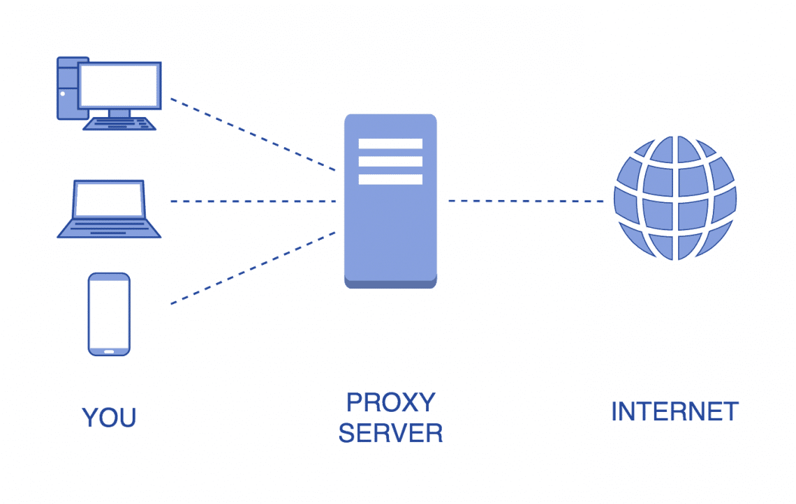

Dans un monde où l'anonymat en ligne est devenu une priorité pour de nombreux utilisateurs, et où contourner les restrictions géographiques est devenu monnaie courante, les outils tels que ProxyChains ont acquis une importance significative. ProxyChains offre une solution flexible et efficace pour masquer l'identité en ligne et accéder à des contenus géo-bloqués en acheminant le trafic à travers une série de serveurs proxy. Dans cet article, nous plongerons dans le monde de ProxyChains, explorant ses différentes facettes, de son installation sur des distributions populaires telles que Kali et Ubuntu, à son utilisation pratique sur différentes plateformes, y compris Windows. Nous détaillerons ses cas d'utilisation variés, depuis le simple besoin de confidentialité jusqu'à des scénarios plus complexes de pivot via SSH et Metasploit.

### Qu'est ce que les proxychains? 

Avant de nous lancer dans l'explication de cette notion, faisons un rappel rapide ce qu'est d'abord un proxy.

### Qu'est ce qu'un proxy?

Un proxy est un type de serveur situé entre un utilisateur et Internet. Il agit comme intermédiaire, en recevant les requêtes de l'utilisateur et les transmettant aux serveurs Internet. Les proxies peuvent être utilisés pour diverses raisons, notamment pour améliorer la confidentialité en masquant l'adresse IP de l'utilisateur, pour contourner les restrictions géographiques ou pour filtrer le contenu web. Ils sont largement utilisés dans les réseaux d'entreprise pour contrôler et sécuriser l'accès à Internet.

Prenons l'exemple où on visite ``https://www.google.com`` Au lieu d'envoyer directement des paquets au serveur de Google, vous les envoyez d'abord au proxy, qui les transmet ensuite à Google. Lorsque Google répond, il envoie les paquets au proxy, qui les renvoie ensuite vers vous. Ainsi le serveur de destination voit les informations du proxy au lieu des nôtres, nous offrant ainsi un certain niveau de confidentialité et donc de sécurité.

### Qu'est ce donc Proxychains?

Les ``Proxychains`` s'appuie sur l'exemple du proxy mentionné ci-dessus. Cependant, au lieu d'utiliser uniquement un serveur proxy, un proxychains route ou "chaîne" le traffic à travers plusieurs serveurs, d'où le terme.

En routant le trafic internet à travers plusieurs serveurs proxy comme ceci, celà rend difficile le traçage jusqu'à notre adresse IP d'origine. Les avantages incluent une intégration avec le réseau Tor, les proxys SOCKS et HTTP, ce qui permet une flexibilité et une meilleure sécurité lors de la navigation sur Internet.

De plus, ``proxychains`` peut être facilement configuré pour fonctionner avec des applications telles que Nmap, SQLmap, crackmapexec etc.

### Proxychains vs Proxychains-ng

Proxychains-ng, "ng" pour "next generation", est une version améliorée du projet proxychains. Il offre une fonctionnalité améliorée et une compatibilité plus grande.

> Proxychains-ng est un programme UNIX qui intercepte les fonctions libc liées au réseau dans des programmes liés de manière dynamique via une DLL préchargée. Il redirige les connexions via des types de proxy tels que SOCKS4a/5 ou HTTP et prend en charge uniquement le protocole TCP.

Autrement dire, lorsque les programmes utilisent des fonctions de la ``bibliothèque C standard`` pour effectuer des opérations réseau (comme la connexion à un serveur distant), ``Proxychains-ng`` intervient pour intercepter ces appels de fonction et rediriger le trafic à travers des proxys configurés. Cela permet à ``Proxychains-ng`` d'agir comme un intermédiaire pour le trafic réseau des programmes ciblés, en les forçant à passer par les proxys configurés.

Outre les cas où proxychains est plus approprié en raison de limitations, l'utilisation de proxychains-ng est généralement recommandée.

### Installation de Proxychains sur Kali-Linux

Proxychains-ng est déjà préinstallé dans Kali. Nous pouvons le vérifier en entrant la commande :

``proxychains4``

Cette commande vous montrera généralement les informations d'utilisation de Proxychains-ng, indiquant qu'il est installé et prêt à être utilisé

Lors de la phase de configuration, le choix du type de chaîne approprié dépend de nos besoins :

    - Pour l'anonymat : Le mode ``Random chains`` ou chaînes aléatoires peut offrir un anonymat plus élevé en routant le traffic à travers les différents serveurs proxy sans ordre précis.

    - En terme de fiabilité : Le mode ``Dynamic chains`` ou chaînes dynamiques offre une résilience en évitant les proxys défaillants.

    - Prévisibilité ou suivi du traffic : Le mode ``Strict chains`` ou chaînes strictes garantit que le trafic suit toujours le même chemin ou l'ordre defit en passant sucessivement du premier au dernier serveur proxy.

    - Pour une question d'équilibrage de charge : Le mode ``round-robin`` répartit les connexions uniformément entre les proxys.

